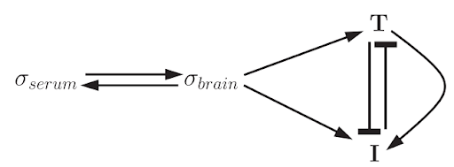
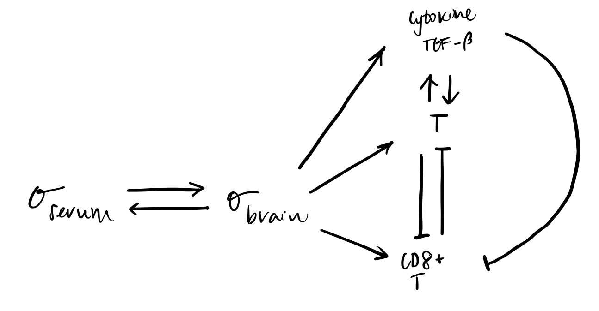
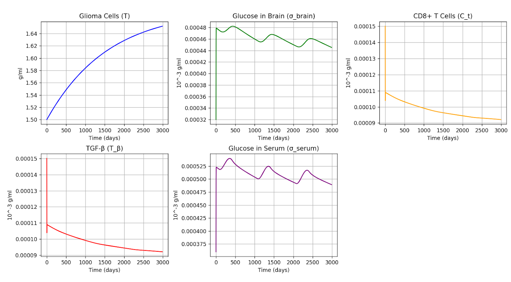
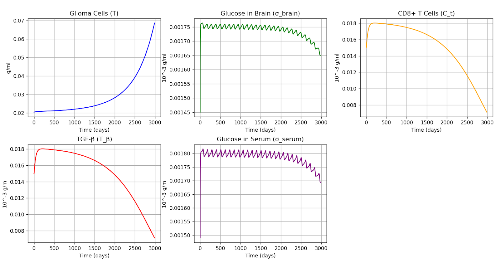
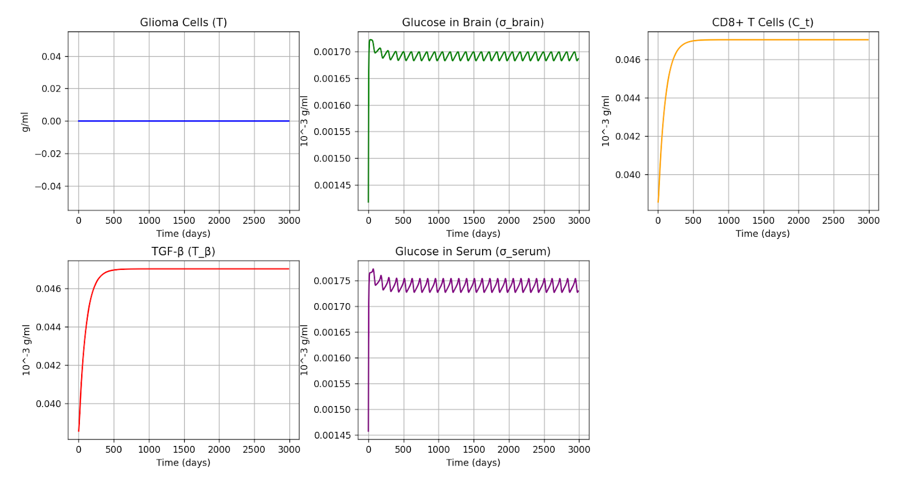

# Modeling Glioma Growth with Immune System Dynamics

### A Differential Equation Framework for the Inclusion of Cytokine TGF-β and CD8+ T Cells  
University of Florida  
Course: MAP4484  
Instructor: Dr. Stacy Stepien  
Date: December 10, 2024  

---

## Team GlioMath
- Kellyna Voyer  
- Kevin Wagner  
- Robert Davis  

---

## 📘 Background

Gliomas are the most common brain tumors, arising from glial cells that support and protect neurons. They vary significantly in behavior and treatment response, ranging from low-grade (slow-growing) to high-grade (aggressive) tumors like glioblastoma multiforme (GBM). GBM is particularly deadly, with a median survival of under 15 months even with aggressive therapy.

These tumors thrive through complex interactions with their **tumor microenvironment (TME)**, which includes:
- **Immune cells** (e.g., tumor-associated macrophages, Tregs)
- **Cytokines** (e.g., TGF-β)
- **Glioma stem cells**
- **Vascular and nervous system components**
- **Extracellular matrix (ECM)**

Chemical factors such as hypoxia, acidosis, and nutrient deprivation create favorable conditions for glioma survival, while **immune suppression**—primarily via TGF-β—limits CD8+ T cell activity, enabling unchecked tumor growth.

---

## 📈 Objective

Our goal was to create a mathematical model using **ordinary differential equations (ODEs)** that captures the biological complexity of glioma-immune interactions—specifically, the suppressive role of **TGF-β** and the tumor-fighting role of **CD8+ T cells**. This project builds upon and extends previous models by adding greater biological realism and granularity to immune interactions.

---

## 🧠 Model Development

We started by replicating the original model presented in *A Mathematical Model of Pre-Diagnostic Glioma Growth* (Sharma et al.), validating its:
- Steady states  
- Graphs  
- Parameter sensitivity analysis  

Our replication matched the **revised version** of their model, which included additional terms like vascularization and tumor mutational burden. However, for clarity, we **excluded those features** to isolate and examine immune interactions more directly.

 
---

## 🔬 Improvements in the GlioMath Model

The original immune term was generalized and oversimplified. Our improvements include:

### ✅ Key Enhancements:
- **Replaced single immune term** with:
  - An ODE for **CD8+ T cells** (anti-tumor effect)
  - An ODE for **TGF-β** (immunosuppressive factor)
- **Explicit tumor-immune dynamics** modeled via upregulation/downregulation terms
- **Biologically informed assumptions**, including:
  - CD8+ T cell suppression by TGF-β
  - Energy dynamics influenced by tumor mass and cytokine production

### 📉 Variable Definitions:
| Variable | Description |
|----------|-------------|
| `T` | Glioma cell concentration |
| `σ_brain` | Brain glucose concentration |
| `CT` | CD8+ T cell concentration |
| `Tβ` | TGF-β concentration |
| `σ_serum` | Serum glucose concentration |

---

## 🧪 Model Equations

We implemented immune-specific ODEs sourced from *A Mathematical Model to Elucidate Brain Tumor Abrogation by Immunotherapy with T11 Target Structure* (Banerjee et al.), integrating their parameters and modifying affected terms accordingly.

### Immune Dynamics Highlights:
- **CD8+ T cells** negatively impact tumor growth (`T`)
- **TGF-β** positively contributes to tumor progression
- **Brain glucose** consumption is adjusted based on both immune and tumor activity

> Note: Our model still assumes spatial homogeneity but is designed to inform future spatio-temporal extensions.

---

## 🧬 Biological Justification

### CD8+ T Cells:
- Infiltrate tumors in response to glioma-associated antigens
- Activated in draining cervical lymph nodes (dCLNs)
- Correlated with improved survival outcomes in glioblastoma patients

### TGF-β:
- Secreted by gliomas to suppress immune response
- Directly inhibits CD8+ T cell activation and infiltration
- Key driver of glioma immune evasion

These additions allow our model to reflect **realistic immune-tumor feedback loops** and offer insight into **therapeutic strategies**, such as:
- **TGF-β inhibition**
- **CD8+ T cell enhancement**
- **Combinatorial immunotherapy**

---

## 📊 Results

### Aggressive Tumor:

### Dormant Tumor:

### Healthy Patient: 

---

## 📚 References

1. Hambardzumyan, D., & Bergers, G. (2015). Glioblastoma: Defining Tumor Niches. *Trends in Cancer*, 1(4), 252–265.  
2. Quail, D. F., & Joyce, J. A. (2017). The Microenvironmental Landscape of Brain Tumors. *Cancer Cell*, 31(3), 326–341.  
3. Lim, M. et al. (2018). Current State of Immunotherapy for Glioblastoma. *Nature Reviews Clinical Oncology*, 15(7), 422–442.  
4. Dunn, G. P. et al. (2007). Emerging Insights into the Molecular and Cellular Basis of Glioblastoma. *Genes & Development*, 21(21), 2683–2710.  
5. Berghoff, A. S. et al. (2015). Prognostic Significance of CD8+ T Cell Infiltrates in Brain Metastases from Lung Cancer. *Clinical Cancer Research*, 21(10), 2526–2535.  
7. Sharma, A. et al. (2022). A Mathematical Model of Pre-Diagnostic Glioma Growth. *Journal of Theoretical Biology*, 543, 111115.  
8. Banerjee, S. et al. (2007). A Mathematical Model to Elucidate Brain Tumor Abrogation by Immunotherapy with T11 Target Structure. *Journal of Theoretical Biology*, 248(3), 433–446.  

---

## 💡 Future Work

- Introduce spatial heterogeneity via PDEs or agent-based modeling  
- Incorporate more immune cell types (e.g., TAMs, Tregs)  
- Model therapy interventions like anti-TGF-β drugs or checkpoint inhibitors  
- Perform sensitivity analysis on additional immune parameters  
